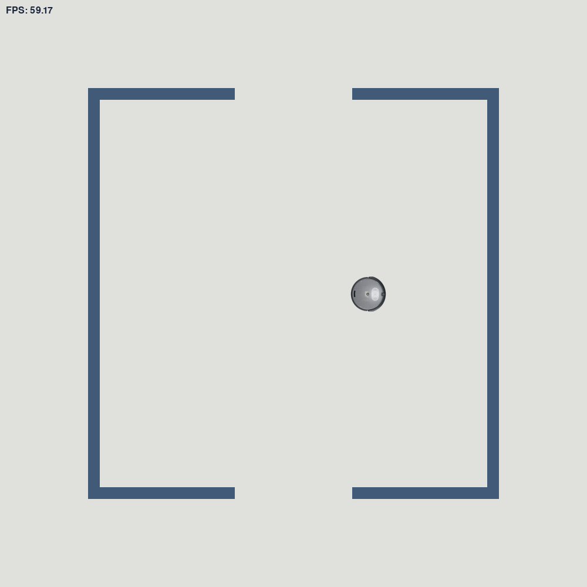

# roslibpygame
Pygame simulator to operate a create3 similar to roslibpy



## TODO List
- [ ] Make Topic Class
- [ ] subscribe to topic
- [ ] publish to topic
- [ ] Make robot move

Sample python code:
```python
import time

import roslibpy

client = roslibpy.Ros(host='localhost', port=9090)
client.run()

talker = roslibpy.Topic(client, '/chatter', 'std_msgs/String')

while client.is_connected:
    talker.publish(roslibpy.Message({'data': 'Hello World!'}))
    print('Sending message...')
    time.sleep(1)

talker.unadvertise()

client.terminate()
```


```python
from __future__ import print_function
import roslibpy

client = roslibpy.Ros(host='localhost', port=9090)
client.run()

listener = roslibpy.Topic(client, '/chatter', 'std_msgs/String')
listener.subscribe(lambda message: print('Heard talking: ' + message['data']))

try:
    while True:
        pass
except KeyboardInterrupt:
    client.terminate()

```